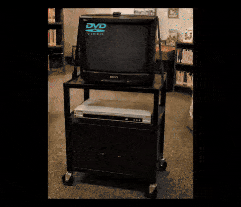

# Corner Watch

[](https://coliver.github.io/corner-watch/)
[](https://github.com/coliver/corner-watch/actions/workflows/pages/pages-build-deployment)


A DVD-logo screensaver for the browser. A logo (or your own photo) bounces
around the screen, changes color on every wall hit, and celebrates with
confetti, a flash, a screen shake, and a fanfare if it ever nails the exact
corner.

| Plain view | TV-frame view (corner hit) |
| --- | --- |
|  |  |

It's a static site: no build step, no runtime dependencies. `app.js` is
loaded as an ES module, so it needs to be served over `http(s)://` rather
than opened directly as a `file://` URL (browsers block module scripts from
`file://`). Serve the folder with anything that serves static files, e.g.:

```
python3 -m http.server 8934
```

then visit `http://localhost:8934/`.

## Files

- `index.html` — markup only
- `styles.css` — all styling
- `app.js` — all behavior
- `image.png` — the default bouncing logo (a white silhouette on a
  transparent background, so it can be tinted with the current bounce color)
- `test/` — the test suite (see Development below)
- `package.json`, `eslint.config.js`, `vitest.config.js` — dev tooling only;
  none of this ships to the page

## Features

- **Classic bounce** — the logo (default: `image.png`, a DVD logo) bounces
  around the window and shifts color on every wall hit.
- **Corner hit celebration** — hitting an exact corner triggers particles, a
  flash, a screen shake, and a fanfare. The bottom-left ticker counts down to
  the next corner hit, or says so if the current speed/position combination
  can never align on one (some combinations mathematically can't). The
  countdown's time value sits behind a spoiler until clicked (click again to
  re-hide it), and the ticker itself can be hidden entirely from the ☰
  settings menu.
- **Custom photo** — "Choose photo…" (under the ☰ settings menu) swaps in
  your own image (or paste one directly into the page). "Clear photo"
  reverts to the default logo. Your choice is remembered in `localStorage`.
- **Trail (☰ settings menu)** — an optional motion trail behind the bouncer,
  off by default. Configurable style (dots / comet / line / rainbow), speed,
  size, fade duration, and opacity, all persisted to `localStorage`.
- **Pong-accurate beeps** — wall/paddle bounce tones use the original 1972
  Atari Pong hardware frequencies (459Hz / 226Hz).
- **HUD auto-hide** — the settings button and countdown ticker fade out
  after a few seconds of no mouse movement, and only fade back in once
  movement has continued for a beat (so a single stray jiggle doesn't flash
  them back on).
- **Reset to defaults** — a button at the bottom of the ☰ settings menu
  reverts every setting (palette, background, photo, sound, countdown, CRT,
  TV frame, trail) to its default in one click.

## Notes

- Everything is client-side; nothing is sent anywhere. `localStorage` only
  holds your trail settings and, if you pick one, your custom photo.
- The color-tint effect on photo mode uses a CSS `mask-image`, which needs
  the image to have real alpha transparency (a plain photo with no
  transparency will just render as a solid color block instead of tinting
  its shape).

## Development

The page itself has zero dependencies, but the test/lint tooling needs
Node.js:

```
npm install
npm test        # runs the test suite with coverage (enforced at 100%:
                 # statements, branches, functions, lines)
npm run lint     # ESLint, including eslint-plugin-unicorn and
                 # eslint-plugin-no-unsanitized
npm run test:watch
```

`app.js` exports its internal functions (and a few pieces of live state)
purely so the test suite can call them directly; nothing else in the app
imports from it.
